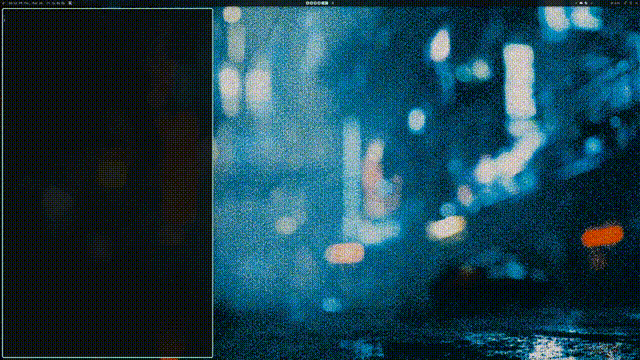
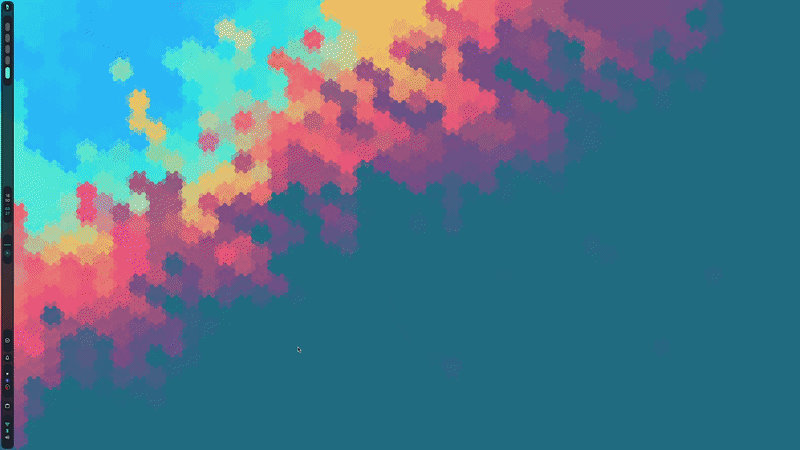
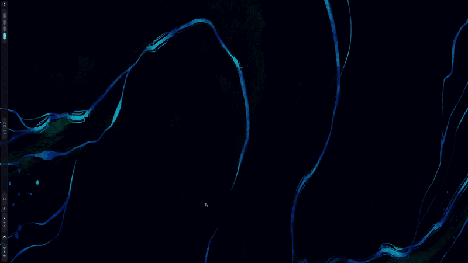
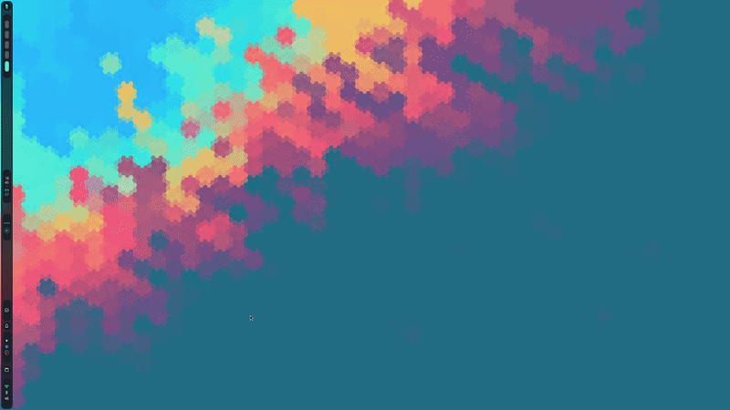

# Showcase

This page lists available animations and their header blocks and demo images.

## bloom

```c
/*
Title: bloom
Authors: chaoscatsofficial@gmail.com
Desc: imported from https://github.com/XansiVA/nirimation
Demo: ./demos/bloom.gif
*/
```

_No demo image found for bloom_


---
---
---

## Dither-glitch

```c
/*
Title: Dither-glitch
Authors: Joe Hsu<jhsu.x1@gmail.com>
Desc: Dither fade in, glitch out
Demo: ./demos/dither-glitch.gif
*/
```




---
---
---

## energize_b_niri

```c
/*
Shader: energize_b
Authors: Justin Garza <JGarza9788@gmail.com>
Based on: Energize B by Simon Schneegans
Desc: Burn-My-Windows Energize B style effect adapted for niri.
Demo: ./demos/energize_b.gif
*/
```


---
---
---

## fold-window

```c
/*
Title: fold-window
Authors: chaoscatsofficial@gmail.com
Desc: imported from https://github.com/XansiVA/nirimation
Demo: ./demos/fold-window.gif
*/
```


---
---
---

## glide

```c
/*
Title: glide
Authors: Justin Garza <JGarza9788@gmail.com>
Desc: a softer Apple-like glide preset for niri.
Demo: ./demos/glide.gif
Notes:
- Smooth, polished, low-bounce motion.
- Open is slightly more luxurious than close.
- Uses custom shaders where niri supports them.
*/
```


---
---
---

## glitch_00

```c
/*
Title: glitch_00
Authors: chaoscatsofficial@gmail.com
Desc: imported from https://github.com/XansiVA/nirimation
Demo: ./demos/glitch_00.gif
*/
```


---
---
---

## glitch_01

```c
/*
Title: glitch_01
Authors: liixini | https://github.com/liixini 
+ adjustments by Justin Garza <JGarza9788@gmail.com> 
Desc: a glitch animation preset for niri.
Demo: ./demos/glitch_01.gif
*/
```




---
---
---

## incinerate

```c
/*
Shader: incinerate
Authors: Justin Garza <JGarza9788@gmail.com>
Based on: incinerate by Simon Schneegans
Desc: A Burn-My-Windows style fire burn effect adapted for niri custom shaders.
Demo: ./demos/incinerate.gif
*/
```




---
---
---

## pixelate

```c
/*
Title: pixelate
Authors: chaoscatsofficial@gmail.com
Desc: imported from https://github.com/XansiVA/nirimation
Demo: ./demos/pixelate.gif
*/
```


---
---
---

## pop-drop

```c
/*
Title: pop-drop
Authors: chaoscatsofficial@gmail.com
Desc: imported from https://github.com/XansiVA/nirimation
Demo: ./demos/pop-drop.gif
*/
```


---
---
---

## prism_fold

```c
/*
Shader: prism_fold
Authors: Justin Garza <JGarza9788@gmail.com>
Desc: A full chromatic prism animation
Demo: ./demos/prism_fold.gif
*/
```


---
---
---

## ribbons

```c
/*
Title: ribbons
Authors: chaoscatsofficial@gmail.com
Desc: imported from https://github.com/XansiVA/nirimation
Demo: ./demos/ribbons.gif
*/
```


---
---
---

## roll-drop

```c
/*
Title: roll-drop
Authors: chaoscatsofficial@gmail.com
Desc: imported from https://github.com/XansiVA/nirimation
Demo: ./demos/roll-drop.gif
*/
```


---
---
---

## smoke

```c
/*
Title: smoke
Authors: liixini | https://github.com/liixini 
Desc: a smoke animation preset for niri.
Demo: ./demos/smoke.gif
*/
```




---
---
---

