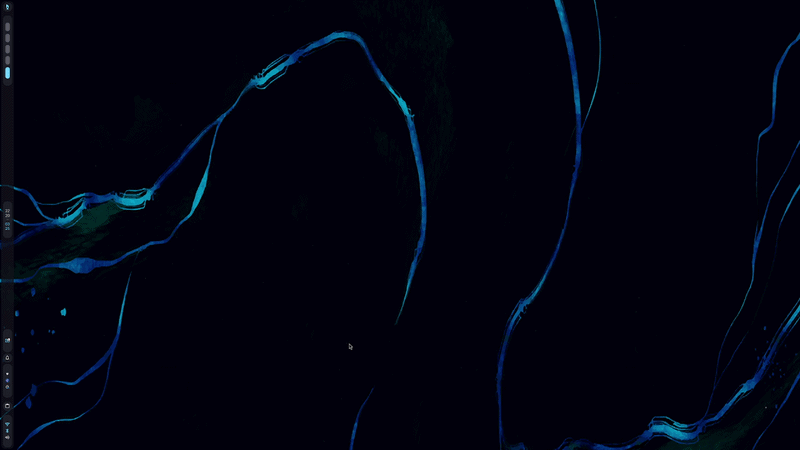
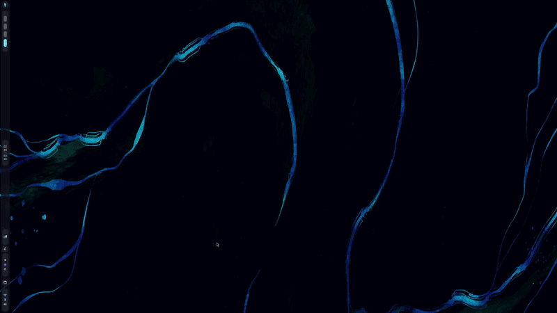

# Showcase

This page lists available animations and their header blocks and demo images.

## bloom

```c
/*
Title: bloom
Authors: chaoscatsofficial@gmail.com
Desc: imported from https://github.com/XansiVA/nirimation
Demo: ./demos/bloom.gif
*/
```

_No demo image found for bloom_


---
---
---

## burn-ashes

```c
/*
Title: burn-ashes
Authors: chaoscatsofficial@gmail.com
Desc: imported from https://github.com/XansiVA/nirimation
Demo: ./demos/burn-ashes.gif
*/
```


---
---
---

## burn

```c
/*
Title: burn
Authors: chaoscatsofficial@gmail.com
Desc: imported from https://github.com/XansiVA/nirimation
Demo: ./demos/burn.gif
*/
```


---
---
---

## burn-multicolor

```c
/*
Title: burn-multicolor
Authors: chaoscatsofficial@gmail.com
Desc: imported from https://github.com/XansiVA/nirimation
Demo: ./demos/burn-multicolor.gif
*/
```

_No demo image found for burn-multicolor_


---
---
---

## fold-window

```c
/*
Title: fold-window
Authors: chaoscatsofficial@gmail.com
Desc: imported from https://github.com/XansiVA/nirimation
Demo: ./demos/fold-window.gif
*/
```


---
---
---

## glide

```c
/*
Title: glide
Authors: Justin Garza <JGarza9788@gmail.com>
Desc: a softer Apple-like glide preset for niri.
Demo: ./demos/glide.gif
Notes:
- Smooth, polished, low-bounce motion.
- Open is slightly more luxurious than close.
- Uses custom shaders where niri supports them.
*/
```




---
---
---

## glitch

```c
/*
Title: glitch
Authors: chaoscatsofficial@gmail.com
Desc: imported from https://github.com/XansiVA/nirimation
Demo: ./demos/glitch.gif
*/
```


---
---
---

## pixelate

```c
/*
Title: pixelate
Authors: chaoscatsofficial@gmail.com
Desc: imported from https://github.com/XansiVA/nirimation
Demo: ./demos/pixelate.gif
*/
```


---
---
---

## pop-drop

```c
/*
Title: pop-drop
Authors: chaoscatsofficial@gmail.com
Desc: imported from https://github.com/XansiVA/nirimation
Demo: ./demos/pop-drop.gif
*/
```


---
---
---

## prism_fold

```c
/*
Shader: prism_fold
Authors: Justin Garza <JGarza9788@gmail.com>
Desc: A full chromatic prism animation
Demo: ./demos/prism_fold.gif
*/
```




---
---
---

## ribbons

```c
/*
Title: ribbons
Authors: chaoscatsofficial@gmail.com
Desc: imported from https://github.com/XansiVA/nirimation
Demo: ./demos/ribbons.gif
*/
```


---
---
---

## roll-drop

```c
/*
Title: roll-drop
Authors: chaoscatsofficial@gmail.com
Desc: imported from https://github.com/XansiVA/nirimation
Demo: ./demos/roll-drop.gif
*/
```


---
---
---

## startrek

```c
/*
Title: startrek
Authors: exodist7@gmail.com
Desc: Niri animations for star trek beam in-out windows
Demo: ./demos/startrek.gif
Notes:
* https://gist.github.com/exodist/370c9151280b4eeed21c3daaaa73305a#file-config-kdl
*/
```


---
---
---

